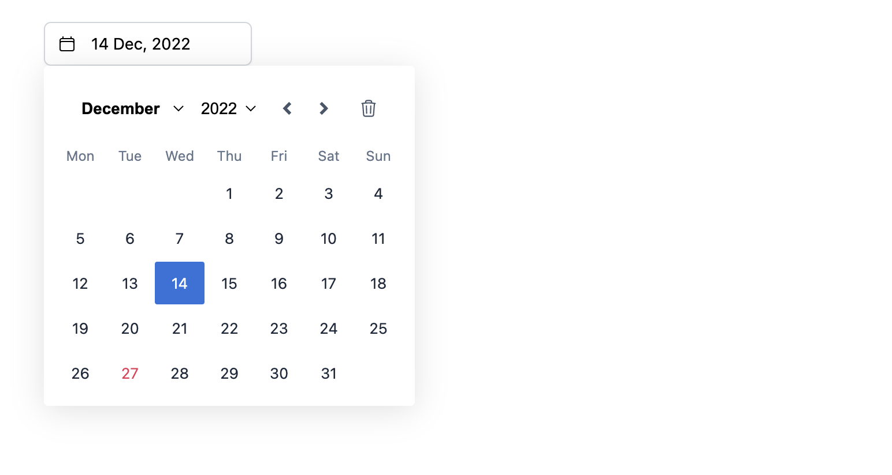

# react-ease-picker

DatePicker and RangePicker base on [easepick](https://easepick.com/).




## Customize
```css
:root {
  --ease-color-bg-default: #fff;
  --ease-color-bg-secondary: #f3f4f6;
  --ease-color-fg-default: #1e293b;
  --ease-color-fg-primary: #2e6fda;
  --ease-color-fg-secondary: #64748b;
  --ease-color-fg-selected: #fff;
  --ease-color-fg-muted: #64748b;
  --ease-color-fg-accent: #e63757;
  --ease-color-btn-primary-bg: #2e6fda;
  --ease-color-btn-primary-fg: #fff;
  --ease-color-btn-primary-border: #2e6fda;
  --ease-color-btn-primary-hover-bg: #2c67cd;
  --ease-color-btn-primary-hover-fg: #fff;
  --ease-color-btn-primary-hover-border: #2c67cd;
  --ease-color-btn-primary-disabled-bg: #80aff8;
  --ease-color-btn-primary-disabled-fg: #fff;
  --ease-color-btn-primary-disabled-border: #80aff8;
  --ease-color-btn-secondary-bg: #fff;
  --ease-color-btn-secondary-fg: #475569;
  --ease-color-btn-secondary-border: #cbd5e1;
  --ease-color-btn-secondary-hover-bg: #64748b;
  --ease-color-btn-secondary-hover-fg: #fff;
  --ease-color-btn-secondary-hover-border: #64748b;
  --ease-color-btn-secondary-disabled-bg: #cbd5e1;
  --ease-color-btn-secondary-disabled-fg: #fff;
  --ease-color-btn-secondary-disabled-border: #cbd5e1;
  --ease-color-border-default: #cbd5e1;
  --ease-color-border-locked: #f9f9f9;
  --ease-day-width: 43px;
  --ease-day-height: 37px;
  --ease-z-index: 40;
  --ease-border-radius: 2px;
  --ease-primary-color: #2e6fda;
  --ease-secondary-color: #64748b;
  --ease-font-family: inherit;
}
```